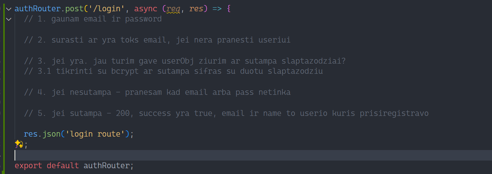

# Practice toliau

1. login route back end 

https://www.npmjs.com/package/bcryptjs

## Front end

1. sukurti contexta ir suteikti visai aplikacijai
2. Padaryti kad headeryje skirtuti linkai priklausomai nuo to ar vartotojas prisijunges ar ne
3. skirtis routai nuo to ar vartotojas prisijunges ar ne
4. sukurti login forma
